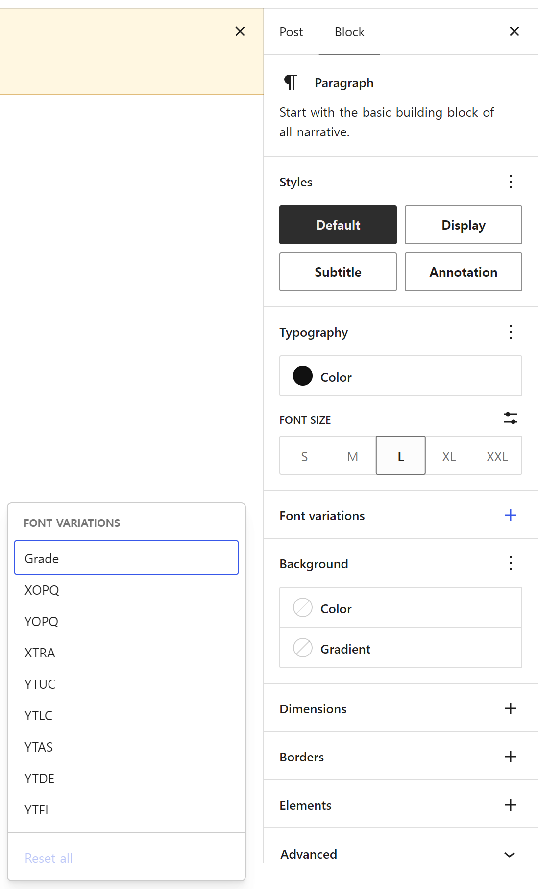
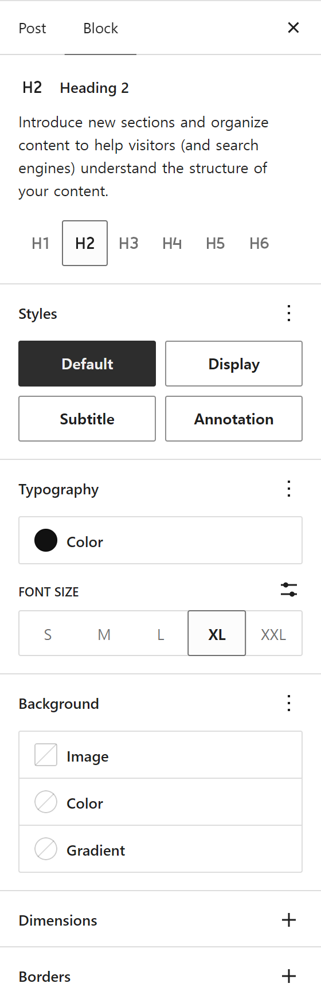
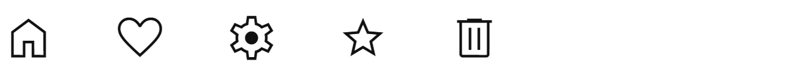
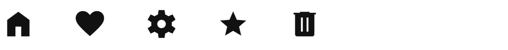

# Gutenberg font variations demo

Playground fixture for the Gutenberg `font-variation-settings` prototype (issue [WordPress/gutenberg#83148](https://github.com/WordPress/gutenberg/issues/83148), pull request [#83159](https://github.com/WordPress/gutenberg/pull/83159)). It is test data, not an Axismundi product.

## What this demo is, and is not

The typography work is several pull requests, each deliberately narrow. This demo shows one of them running, so reading it as "everything at once" would be wrong. What it stands on, and what it leaves out:

| | |
|-|-|
| **Base** | Gutenberg `trunk`, which includes [#83128](https://github.com/WordPress/gutenberg/pull/83128) (weight ranges read whole) |
| **Demonstrated** | [#83159](https://github.com/WordPress/gutenberg/pull/83159) — face `axes`, `settings.typography.fontVariations` as a boolean, the Font variations panel, `styles.typography.fontVariationSettings` |
| **Not included** | [#83456](https://github.com/WordPress/gutenberg/pull/83456) (a two-angle `oblique` range resolved to a usable style), [#83141](https://github.com/WordPress/gutenberg/pull/83141) (any weight in a variable font's range), the Style and slant controls discussed in [#83148](https://github.com/WordPress/gutenberg/issues/83148), which nobody has opened |

So the Appearance control here is the one trunk ships: with the oblique face registered, its Style list still shows the declared range as written. That is #83456's subject, not this demo's.

## What it sets up

- **Capability:** Roboto Flex, with every axis of its `fvar` table in each face's `axes` list, registered as two faces from one file — `normal`, and `oblique 0deg 10deg` for the `slnt` axis. The range reads 0 to 10 rather than −10 to 0 because `font-style: oblique <angle>` takes the angle with the sign flipped from OpenType's.
- **Availability:** `settings.typography.fontVariations`, a boolean, `true` for the site and `false` for `core/heading`. It says whether the panel is offered, not which axes exist — the faces already declare those.
- **Styles:** Roboto Flex as the site font.
- **Content:** a "Font variations demo" post with a Heading, two Paragraphs and a List. `/wp-admin/?font-variations-demo` opens it in the editor.

## What to check

1. Paragraph: Styles → Font variations is there, with no controls yet, and its options menu lists the font's custom axes (Grade, XTRA and the rest). `opsz`, `wght`, `wdth`, `slnt` and `ital` are not offered, being the axes OpenType registers.
2. Add Grade from that menu: a slider appears at the font's own default, 0. Change it and the paragraph gets `font-variation-settings: "GRAD" <n>`, in the editor and on the front end, with bold text inside it still bolder.
3. Heading: no Font variations panel, since the block sets `fontVariations` to false. A value already saved on it stays saved.
4. List: no panel either, as the block has no support.
5. Pick another font in Typography on the paragraph: its axis values are cleared and the panel follows the new font.
6. Site Editor → Styles → Typography → Text shows the same panel; Styles → Blocks → Heading does not.

## Screenshots

Taken in the editor on the #83159 build (`6bcadcaf78`), so they show the panel as the prototype renders it rather than as this README describes it.

**The panel for a Roboto Flex paragraph.** Its menu offers the nine axes the file declares and WordPress has no property for. `opsz`, `wght`, `wdth`, `slnt` and `ital` are absent: those are the axes OpenType registers, and they belong to `font-size`, `font-weight`, `font-stretch` and `font-style`.

**The same font on the Heading block**, which sets `fontVariations` to false. Typography is still there; Font variations is not. Availability is per block, and it is the only thing a theme decides.

**An axis with no CSS property at all.** Material Symbols draws an icon outlined at `FILL` 0 and solid at `FILL` 1, in the same file, with no property that could ask for it. Nothing in `font-weight` or `font-style` reaches this; `styles.typography.fontVariationSettings` is the only place it can be written.

Material Symbols appears only here, not in the Playground fixture. The font is 3.9 MB, and an icon font must not be glyph-subset in a product, since its ligatures depend on the whole glyph table. Two screenshots cost nothing and show the same thing.

## Files

| File | |
|-|-|
| `demo-plugin/gutenberg-font-variations-demo.php` | The fixture plugin. Playground installs this directory. |
| `demo-plugin/assets/RobotoFlex.woff2` | The font. |
| `demo-plugin/assets/OFL.txt` | The font license. |
| `screenshots/` | The captures above. |

The font sits inside `demo-plugin/` so that installing that one directory brings the font and its license with it.

## Font

- **Font:** Roboto Flex
- **Source:** Google Fonts, [google/fonts `ofl/robotoflex`](https://github.com/google/fonts/tree/main/ofl/robotoflex), original file `RobotoFlex-VariableFont_GRAD,XOPQ,XTRA,YOPQ,YTAS,YTDE,YTFI,YTLC,YTUC,opsz,slnt,wdth,wght.ttf`
- **Processing:** converted to WOFF2 with `pyftsubset`, format conversion only: no glyph subset, all 13 variable axes kept. The same file as the Axismundi theme's `assets/fonts/roboto-flex/axismundi-roboto-flex.woff2` (SHA-256 `7b949602f09c57b8…`).
- **License:** SIL Open Font License 1.1, see `demo-plugin/assets/OFL.txt`.
- **Purpose:** Gutenberg `font-variation-settings` Playground fixture.

## Playground

Gutenberg itself comes from the pull request's CI build ZIP: Playground cannot build a Gutenberg source branch. This directory is installed with a `git:directory` resource pinned to a commit SHA, so later changes here do not change a published demo.

The [blueprint](blueprint.json) installs the fixture. Load it with the target
Gutenberg PR through Playground's `gutenberg-pr` query parameter.
